# 🎬 SIM-PROJECT — Cinema Queue Optimization  

<sub>🗓️ Developed in September 2024</sub>  

This project presents a simulation-based study on how to solve the **ticket and food queues problem** in the Parc Vallès cinema, using the **FlexSim** tool.

---

## ✅ Features

- Simulation model of ticket and food queues with 3 scenarios:
1. **Model1**: 7 food sale points and 3 ticket sale points.  
2. **FinalModel**: 8 food sale points and 2 ticket sale points.  
3. 9 food sale points and 1 ticket sale point.  
And 2 validation points in all of them.  
- Data-driven configuration to reflect real cinema operation.
- Analysis of queue bottlenecks and optimization strategies.
- Easy-to-run `.fsm` model file for testing.
- Data studies and verification.
- Experiment design and analysis.
- Non-deterministic model.

---

## 🛠 Installation & Setup

### 1.1 Install FlexSim  
Download and install **FlexSim** from the [official website](https://www.flexsim.com/).

### 1.2 Try out the simulations  
Download the following files and run the simulation yourself!!
```plaintext
Model1.fsm
FinalModel.fsm
```
> **Note:**  
> A model size limit issue may appear because of the PRO Plan used for the project.  
> Therefore, in the models (especially in the FinalModel.fsm), the results displayed when simulating the model are not real because there are object limitations.

### 2 Understand the results
Download the following files to see more detailed data and to understand the project approach and results:
```plaintext
FinalMemory.pdf
Model1_experiment_data.html  
FinalModel_experiment_data.rar
```

---

## 📷 Screenshots  

### Conceptual Model:
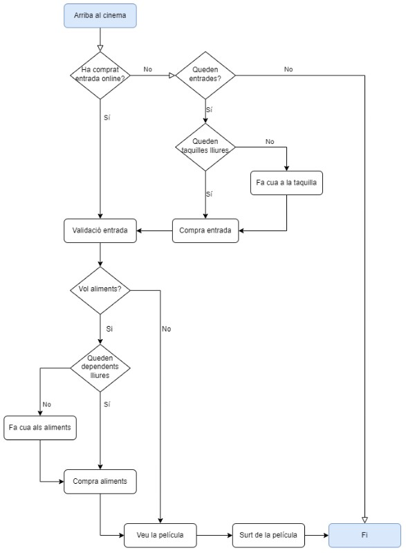
- 
### First Model Simulation:
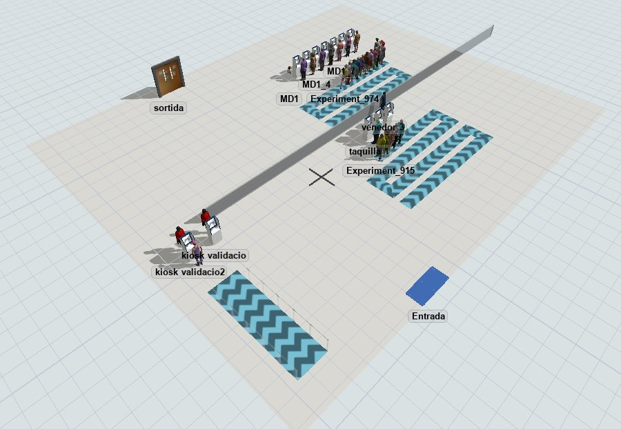
-
### First Model Statistics:
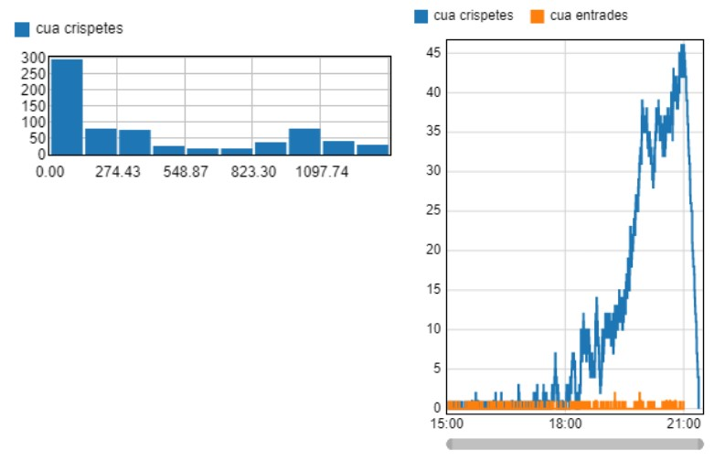
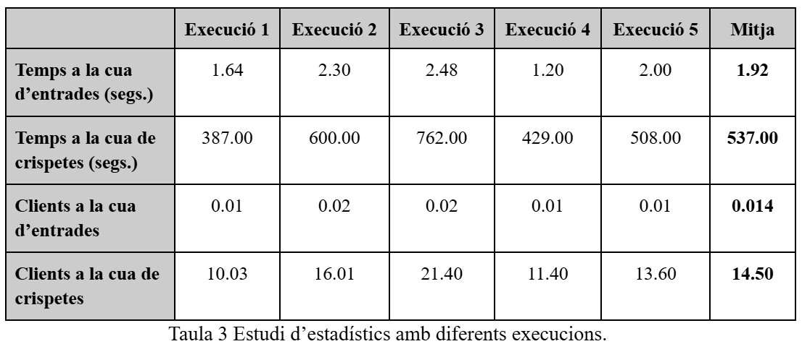
-
### "Final Model Simulation" (1 ticket booth missing — FlexSim PRO license limit):
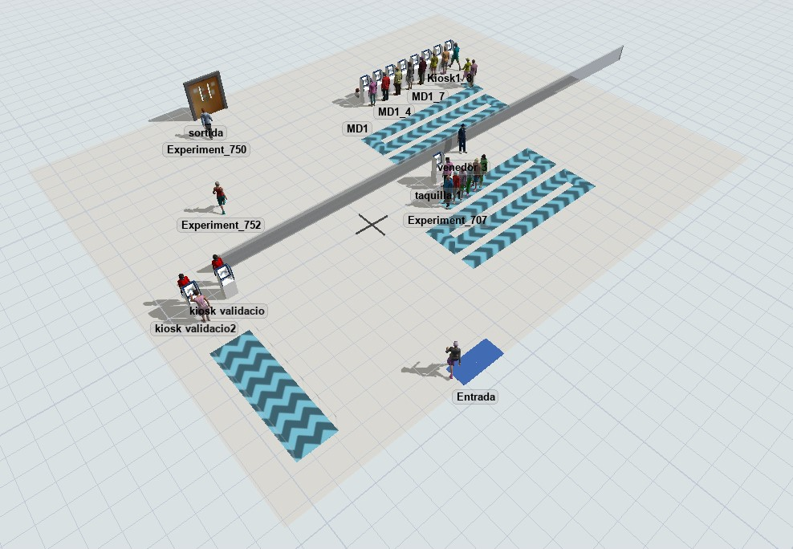
-
### Model Patient Flow:
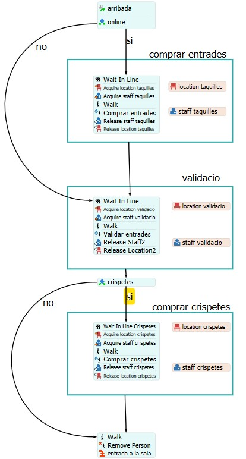
-
### 3 Scenarios Comparison:
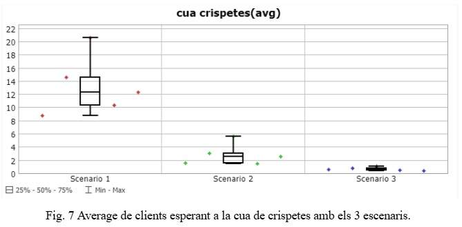
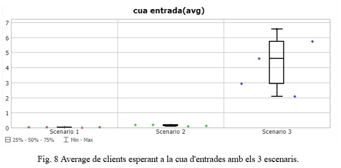
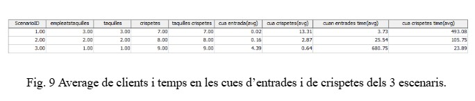
-
### Optimizer (Configuration, Results & Summary):
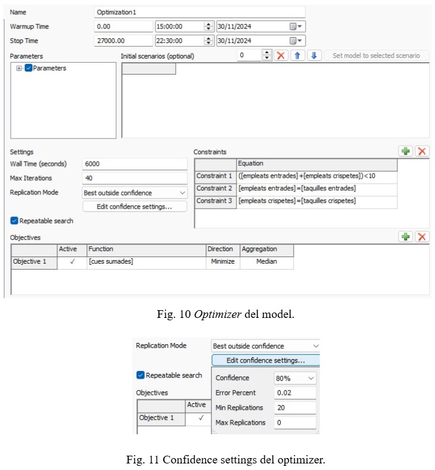
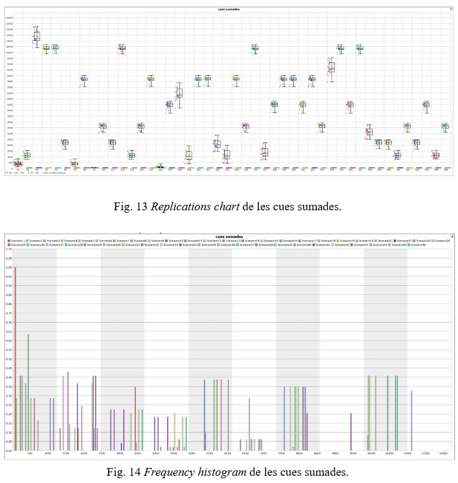
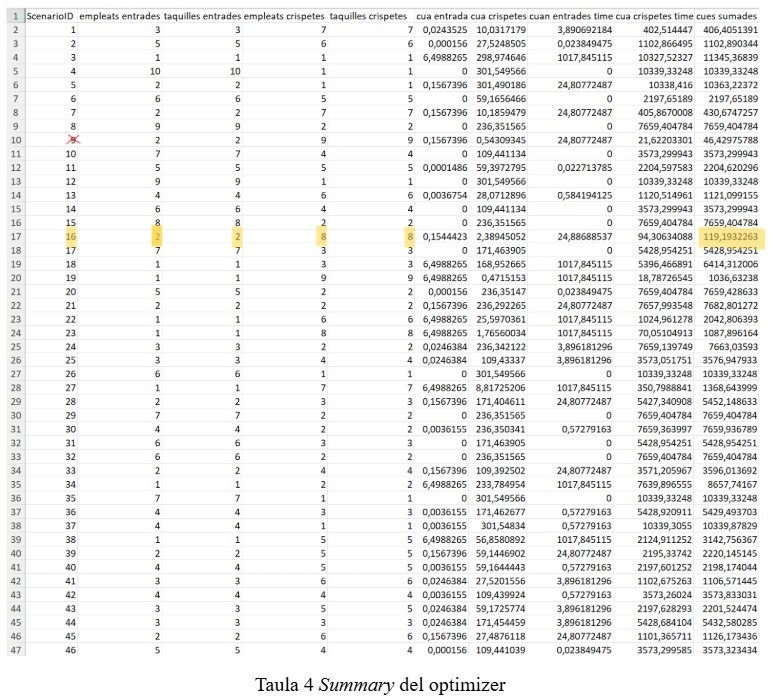

---

## ⚖️ Copyright & License

© 2024 Marc Turu Roca and collaborators. All rights reserved.  
This project is the joint intellectual property of its authors.  
No part may be copied, modified, distributed, or used without prior written permission from all authors.  

- Marc Mostazo  
- Sergio Sadornil  
- Marc Turu
